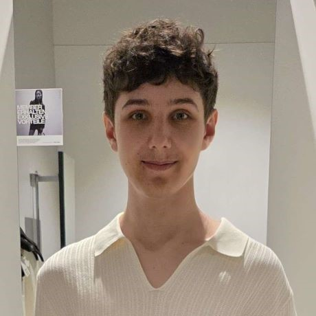

# Repus Oiram 🧙

***

## 📝 Description

* Repus Oiram tells the story of a small wizard named Repus, who must brave perilous levels and overcome fierce enemies
  to rescue his kidnapped wife, Hcaep.

***

## 🧩 Features

* **6 Challenging Levels**
    * Progressively harder stages with no respawn points – if you die, you restart the level.

* **Time Tracking**
    * Your completion time is recorded throughout the game.

* **Enemy Types**
    * Encounter three unique enemy types:
        * **Ground Enemy** – basic but dangerous.
          * 
        * **Flying Enemy** – dragon/bird creatures soaring through the skies.
          * 
        * **Jumping Enemy** – frog-like enemies with unpredictable movements.
          * 

* **Immersive Sound Effects**
    * Unique sounds for different in-game events.

* **Atmospheric Music**
    * A mysterious and thrilling soundtrack to enhance the mood.

* **Story Mode**
    * Discover Repus's journey through short story scenes before each level.

***

## 🎮 How to Play

1. **Launch the Game**
    * The game opens with the start menu.
      * 
    * Use the volume menu (top-left) to adjust music and sound effects.
      * 

2. **Select a Level**
    * Click *Start* to open the level selection screen.
    * Only Level 1 is unlocked by default.
    * Finish levels to unlock new ones.
    * Information at the bottom of the screen includes:
        * Level Name
        * Level Description
        * Difficulty
        * Record Time
        * 

3. **Story Segment**
    * After selecting a level, you'll see a short story scene about Repus’s adventure. 
      * 

4. **Gameplay**
    * Navigate obstacles, defeat enemies, and make it to the end tower to finish the level.
      * 
      * 
    
***

## ⌨️ Controls

| Action     | Key / Button | Description                     |
|------------|:------------:|---------------------------------|
| Move Left  |      A       | Move the character to the left  |
| Move Right |      D       | Move the character to the right |
| Jump       |    SPACE     | Make Repus jump                 |
| Pause Menu |     Esc      | Open the pause menu             |

***

## 👨‍💻 Authors

* **Marcel Bramberger** – Designer & Animator
  * 
* **Robin Haubner (Project-Manager)** – Developer
  * 
* **Kevin Lichtl** – UI Designer & Developer
  * 
* **Leander Mikota** – Developer
  * 